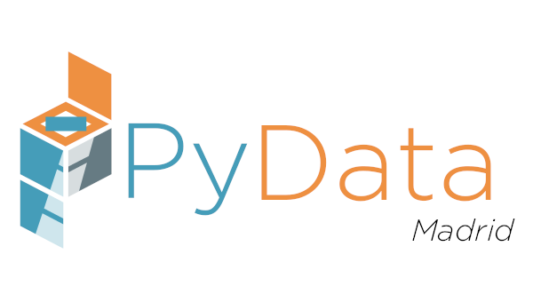

# PyData Madrid

Nos reunimos el tercer o cuarto jueves de cada mes para hablar de Python, Datos, Visualización, Inteligencia Artificial, ¡y lo que surja! Dos charlas y un poco de networking. ¡Únete!

- 📣 Regístrate en Meetup para enterarte de las siguientes reuniones https://www.meetup.com/PyData-Madrid/
- 📺 Mira los eventos anteriores https://www.youtube.com/@pydatamadrid
- 🦣 Síguenos en redes sociales https://masto.ai/@pydatamadrid, https://www.linkedin.com/company/pydata-madrid/
- 🎤 Propón una charla o taller https://airtable.com/shriz8iaDzA6jf9TM

---

We meet the third or fourth Thursday of each month to talk about Python, Data, Visualization, Artificial Intelligence, and more! Two talks and a bit of networking. Join us!

- 📣 Register on Meetup to be notified of the next meetups https://www.meetup.com/PyData-Madrid/
- 📺 Watch previous talks https://www.youtube.com/@pydatamadrid
- 🦣 Follow us on social media https://masto.ai/@pydatamadrid, https://www.linkedin.com/company/pydata-madrid/
- 🎤 Propose a talk or workshop https://airtable.com/shriz8iaDzA6jf9TM
